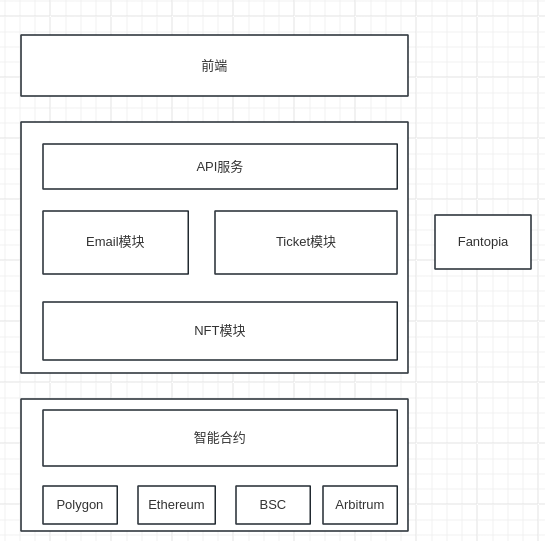

# Fansland-backend
fansland后端

## 模块拆分

- `api`: 提供api接口供前端使用

- `nft`: 监听链上NFT合约`Transfer`事件

- `ticket`: 调用`Fantopia`API的接口生成门票二维码

- `email`: 发送邮件

## API

- 活动相关:
  - `queryEventsInfo`: 查询活动信息
- 用户登录相关:
  - `loginByWallet`: 钱包登录
  - `queryBindEmail`: 查询绑定邮箱
  - `bindEmail`: 绑定邮箱
- 门票相关:
  - `queryTickets`: 获取门票列表
  - `queryTicketQrCode`: 查询门票二维码
  - `setSecretLinkPassword`: 设置私密链接密码
  - `secretLink`: 私密链接访问我的门票

## nft模块

- 监听NFT合约`MintNft`交易事件, 存入数据库
- 监听NFT合约`Transfer`交易事件, 存入数据库

## ticket模块

- 处理数据库中的Event,同时更新门票状态，调用Fantpia创建门票/刷新

## email模块

- 给用户发送门票邮件
